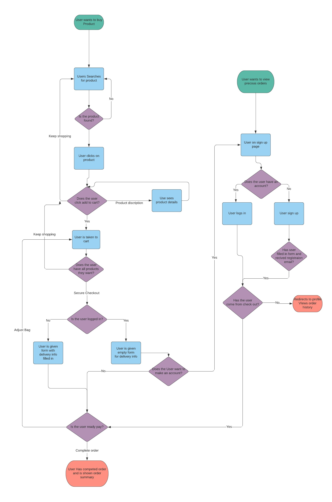

<a name="top"></a>
<div align="center">

</div>

<div align="center">
<h1>No Bikes No Bueno</h1>
</div>

---

     

---

<div align="center">

</div>

---

## Links

### [Introduction](#intro)
### [Users Thought Process](#thought)
### [User stories](#userstories)
### [Features & Wireframes](#features)
### [Features left to implement](#left)
### [Fonts and Colours](#theme)
### [Database Models](#database)
### [Features left to implement](#left)
### [Technologies used](#tech)
### [Testing](#testingsection)
- [Validators](#code)
- [Manual testing](#manual)
- [User story testing](#usertesting)
- [Unit Testing](#unit)
- [Issues & bugs](#issues)
### [Deployment](#deploy)
### [Credits & acknowledgements](#credits)

---
<a name="intro"></a>

No Bikes No Bueno is a group of mountain bike riders based in the Lake District and Hamsterley Forest in England. The group has an Instagram page where they share all their antics. They are currently using this page to sell their merchandise which consists of jumpers, t-shirts and stickers. The No Bikes No Bueno website will make the process of selling their products much easier and will make the whole company more professional.
The website consists of the main products page, riders bio page and contact page. The website will be supported by the python backend, allowing the admin to add, edit and remove any of the merchandise or bios. The contact page will have a form allowing the user to email the admin with any questions freeing up the Instagram page enabling it to be just used for content. As well as this the website will have an integrated login system allowing the user to save their delivery information and view any previous orders.

## Project goals

The website will be designed to make it easy for the NBNB(No Bikes No Bueno) group to sell their merchandise, give the user information on the members and make it easy for the user to get in contact with them.

To test the login and account functionality create any user. To use the payment service, use the card number 4242 4242 4242 4242, expiry of any future date and postcode of any 5 integers.

## [https://nobikesnobueno.herokuapp.com/](https://nobikesnobueno.herokuapp.com/)

### :arrow_up:[Top of page](#top)

---

<a name="thought"></a>

## :thought_balloon: User Thought Process

This a flow chart representing the thought process of the user if they want to buy products and view order history.

<div align="center">

</div>

### :arrow_up:[Top of page](#top)
---

<a name="userstories"></a>

## User Stories

| As a | I want to be able to | So that I can |
| --- | --- | --- |
| Customer | View all the merch | See the products that are for sale |
| Customer | View details of the item | Know information about the product |
| Customer | View my shopping cart |Know what items I am buying and their price |
| Customer | View my shopping bag | Know what I am spending |
| Customer | Search for a product | To find products more easily |
| Customer | Select a quantity of an item | Make a decision on whether this is a product I want | 
| Customer | Change the quantity of an item in my bag | Change the amount I have chosen |
| Customer | Remove products | Change my mind about buying an item |
| Customer | To be able to pay without being logged in | Buy merch without an account |
| Customer | Enter card information | Pay for the merch |
| Customer | Contact NBNB | Inform NBNB about problems |
| |
| Fan/Regular | Sign up for an account | Have a personal profile on site |
| Fan/Regular | Log in | Have access to my profile |
| Fan/Regular | Have an account | So I can save delivery info and view previous orders |
| Fan/Regular | View Rider | Find out more about NBNB |
|    |


[See here for user story testing](#usertesting)

### :arrow_up:[Top of page](#top)
---

<a name="features"></a>

## Features & Wireframes

### Home Page

[Home Page Wireframe](readmeimages/home.PNG) 

On the home app, you are first greeted by a hero image with a small description of the ethos of the brand. Underneath, is where the products are displayed so the users are able to shop from the moment the webpage loads. There is a dropdown to sort the products in various order, a search bar, and a section to show the user how many products were found. Any messages can also be found here.
On each product, there is a link to the products detail page and a button to add a single item to the bag. As the product cards are responsive, the amount of items displayed on each row with vary depending on the screen size.
There is a navbar at the top of each page to allow the user to navigate through the site fluidly. The navbar is completely responsive and changes the layout of the links depending on the size of the screen. The shopping cart icon will disappear and change to the text in a mobile view, as well as giving the user a live total of the cart.

### Product Page

[Product Page Wireframe](readmeimages/product.PNG) 

On the product detail pages, there is an image of the product, price and a brief description. Under this, there is a quantity input with custom buttons, to make the input easier to use in mobile view. There are also two buttons, one to add the product to the cart and another that sends the user back to the home page to find more products. Any messages are displayed at the top of the screen.


### Shopping Page

[Shopping Cart Page Wireframe](readmeimages/cart.PNG) 

In the shopping cart, the user can see an image, the name, the SKU, and the price of the products they are about to buy. The is a quantity box with custom buttons and options to update the quantity and remove the product from the cart. There is also a total of the items in the cart, set delivery price and a grand total of the items and delivery. The user is then given the option to keep shopping or checkout.


### Checkout Page

[Checkout Page Wireframe](readmeimages/checkout.PNG) 

On the Check out page, there is an order summary selection that shows the user what they are about to buy. Next to this, there is a form that takes the user's contact information and delivery details. If the user is logged in the form will be prefilled with the saved user data. They will then be given the option to overwrite this by clicking the check box to save their data. If the user is not logged in, they will be given the options to log in or sign up for an account. Underneath this, there is a custom stripe input box that allows the user to pay through the stripe payment service. 

Once the order has gone through successfully an email will be sent to the user confirming their order. The user will then be redirected to another page that contains a summary for the order and a button that sends them back to the home page.

### Profile

[Profile Page Wireframe](readmeimages/profile.PNG) 

On the Check out page, there is an order summary selection that shows the user what they are about to buy. Next to this, there is a form that takes the user's contact information and delivery details. If the user is logged in the form will be prefilled with the saved user data. They will then be given the option to overwrite this by clicking the check box to save their data. If the user is not logged in, they will be given the options to log in or sign up for an account. Underneath this, there is a custom stripe input box that allows the user to pay through the stripe payment service. 

Once the order has gone through successfully an email will be sent to the user confirming their order. The user will then be redirected to another page that contains a summary for the order and a button that sends them back to the home page.

### Rider Bios

[Profile Page Wireframe](readmeimages/riders.PNG) 

On the Riders page, the user can see all the riders in NBNB. This shows their name, a description and a profile image.

### Contact Form

[Profile Page Wireframe](readmeimages/riders.PNG)

On the contact page, there is a form the user can fill to send a message to the NBNB. Upon submitting the form, an email will be sent to the NBNB team and another email will be sent to the user to confirm that the email was received.


### :arrow_up:[Top of page](#top)
---

<a name="left"></a>

## Features left to implement

- Sizing selection for products that have different sizes.- I would also add email functionality to both the user login process and order confirmation process.
- A rating and comments system for the products.
- If there were more products on the site I would add a category selector but as there is only a small amount of products, I thought this was unnecessary for now.
- Added 404, 500 and other HTTP error pages.
- Make the delivery cost adjustable by the admin.
- Make the delivery cost adjustable by the admin.
- Make the delivery cost adjustable by the admin.

### :arrow_up:[Top of page](#top)
---

<a name="theme"></a>

## Colours and Fonts

### Colours

- `#808080` (grey) - Main Content Background
- `#ffffff` (white) - White Backgrounds
- `#000000` (Black) - Main text
- `#E8E4D6` - Secondary text
- `#FAFAFA` - Button Text
- `rgba(245, 243, 242)` - Hero Background
- `#545B62` - Custom Buttons to match Bootstrap secondary buttons
- `#21529 `- Custom Buttons to match Bootstrap dark buttons

### Fonts

I acquired the fonts from Google fonts. I used **Noto** for the headings and titles as I believe this was a close match to the No Bike No Bueno Logo. **Roboto** compliments Noto so I have used this for the main content of the website. I also used **Itim** for the text on the hero image as it gave a friendly and fun feel to the website.


### :arrow_up:[Top of page](#top)

---

<a name="database"></a>

## Database Structures

During the development of the project, SQLite3 was used as this is the default database included with Django. On deployment, the database used is PostgreSQL as this is the database used by Heroku. AWS was used to store all static files and images.

### Checkout app

#### Order Model

| Name             | Key              | Field Type    | Validation                                                                                    |
| ---------------- | ---------------- | ------------- | --------------------------------------------------------------------------------------------- |
| Order Number     | order_number    | CharField     | max_length=32, null=False, editable=False                                                    |
| User             | user_profile    | ForeignKey    | UserProfile, on_delete=models.SET_NULL, null=True, blank=True, related_name='orders'       |
| Full Name        | full_name       | CharField     | max_length=50, null=False, blank=False                                                       |
| Email            | email            | EmailField    | max_length=254, null=False, blank=False                                                      |
| Phone Number     | phone_number    | CharField     | null=False, blank=False, max_length=13                                                       |
| Country          | country          | CountryField  | blank_label='Country *', null=False, blank=False                                            |
| Post Code        | postcode         | CharField     | max_length=20, null=False, blank=False                                                       |
| Town or City     | town_or_city   | CharField     | max_length=40, null=False, blank=False                                                       |
| Street Address 1 | street_address1 | CharField     | max_length=80, null=False, blank=False                                                       |
| Street Address 2 | street_address2 | CharField     | max_length=80, null=False, blank=False                                                       |
| County           | county           | CharField     | max_length=80, null=False, blank=False                                                       |
| Date             | date             | DateTimeField | auto_now_add=True                                                                           |
| Delivery         | delivery_cost   | DecimalField  | max_digits=6, decimal_places=2, null=False, default=10                                      |
| Order Total      | order_total     | DecimalField  | max_digits=10, decimal_places=2, null=False, default=0                                      |
| Grand Total      | grand_total     | DecimalField  | max_digits=10, decimal_places=2, null=False, default=0                                      |
| Original Bag     | original_bag    | TextField     | null=False, blank=False, default=''                                                           |
| Stripe           | stripe_pid      | CharField     | max_length=254, null=False, blank=False, default=''                                          |

#### Order Model

| Name     | Key             | Field Type   | Validation                                                                           |
| -------- | --------------- | ------------ | ------------------------------------------------------------------------------------ |
| Order    | order           | ForeignKey   | Order, null=False, blank=False, on_delete=models.CASCADE, related_name='lineitems' |
| Product  | product         | ForeignKey   | Product, null=False, blank=False, on_delete=models.CASCADE                          |
| Quantity | quantity        | IntegerField | null=False, blank=False, default=0                                                   |
| Total    | lineitem_total | DecimalField | max_digits=6, decimal_places=2, null=False, blank=False, editable=False            |

### Home App

#### Products Model

| Name        | Key         | Field Type   | Validation                                                |
| ----------- | ----------- | ------------ | --------------------------------------------------------- |
| SKU         | sku         | CharField    | max_length=50, null=True, blank=True                     |
| Name        | name        | CharField    | max_length=50, null=False, blank=False                   |
| Description | description | TextField    | max_length=500, null=True, blank=True                    |
| Price       | price       | DecimalField | max_digits=6, decimal_places=2, null=False, blank=False |
| Image URL   | image_url  | URLField     | max_length=1024, null=True, blank=True                   |
| Image       | image       | ImageField   | null=True, blank=True                                     |

### Profiles App

The User model has been taken from All-auth and is imported from django.contrib.auth.models.

#### User Profile Model

| Name             | Key                       | Field Type    | Validation                                    |
| ---------------- | ------------------------- | ------------- | --------------------------------------------- |
| User             | user                      | OneToOneField | User, on_delete=models.CASCADE               |
| Phone Number     | default_phone_number    | CharField     | max_length=20, null=True, blank=True         |
| Street Address 1 | default_street_address1 | CharField     | max_length=80, null=True, blank=True         |
| Street Address 2 | default_street_address2 | CharField     | max_length=80, null=True, blank=True         |
| Town or City     | default_town_or_city   | CharField     | max_length=40, null=True, blank=True         |
| County           | default_county           | CharField     | max_length=80, null=True, blank=True         |
| Country          | default_country          | CountryField  | blank_label='Country', null=True, blank=True |
| Postcode         | default_postcode         | CharField     | max_length=20, null=True, blank=True         |

### Riders App

#### Rider Model

| Name        | Key         | Field Type | Validation                               |
| ----------- | ----------- | ---------- | ---------------------------------------- |
| Name        | name        | CharField  | max_length=50, null=False, blank=False  |
| Description | description | TextField  | max_length=500, null=False, blank=False |
| Image URL   | image_url  | URLField   | max_length=1024, null=True, blank=True  |
| Image       | image       | ImageField | null=True, blank=True                    |

### :arrow_up:[Top of page](#top)

---
<a name="tech"></a>

## Technologies used

- [HTML](https://en.wikipedia.org/wiki/HTML) - Main structure of site
- [CSS](https://en.wikipedia.org/wiki/CSS) - Styling and making the website responsive
- [JavaScript](https://en.wikipedia.org/wiki/JavaScript) - Language for front end logic
- [jQuery](https://jquery.com/) - Framework used for DOM manipulation
- [Python](https://www.python.org/) - Language used for back end logic
- [BootStrap](https://getbootstrap.com/) - Framework used for the front end structure and buttons
- [Django](https://www.djangoproject.com/) - Framework used for backend to make the website modular and to structure the backend
- [Font-Awesome](https://fontawesome.com/) - Icon Library used for site
- [Google fonts](https://fonts.google.com/) -  All fonts on the website
- [Heroku](https://www.heroku.com) - Used for deployment of website
- [AWS](https://aws.amazon.com/) - Storage of media in a cloud service
- [Stripe](https://stripe.com/) - Payment Service for website
- [Git](https://git-scm.com/) - Version Control
- [Gitpod](https://www.gitpod.io/) - IDE used for development
- [Balsamiq](https://balsamiq.com/) - Wireframing softwar
- [Favicon](https://en.wikipedia.org/wiki/Favicon) - Generate the Icon on the webpage tab.
- [All-Auth](https://django-allauth.readthedocs.io/) - Authentication logic and templates


### :arrow_up:[Top of page](#top)
---
<a name="testingsection"></a>

## Testing
<a name="code"></a>
- [Validatior](#code)
- [Manual testing](#manual)
- [User story testing](#usertesting)
- [Further testing](#Unit)
- [Screen-size testing](#screen)

### Code testing

- [W3C HTML Validation Service](https://validator.w3.org/#validate_by_input) - There are multiple errors are due to Django rendering. I am aware there are other errors but I was unable to fix these due to time constraints. 

- [W3C CSS Validation Service](https://jigsaw.w3.org/css-validator/validator) - CSS validation passed

- Flake8(`python3 -m flake8`)
    
All errors have been fixed apart from:

- F401 - import env is in an if statement
- E501 - errors remain as the lines cannot be shortened
- DJ01 - as null=True should be in the model


<a name="manual"></a>

### Manual testing

Manual Testing was completed in Chrome Web Developer Tools and use the desktop, iPad, iPhone X, Pixel 2 and Galaxy S5. The website was also tested Mozilla firefox and Microsoft edge


#### Home page

- Logo has rendered on all screen sizes
- Home link works on all screen sizes
- Riders link works on all screen sizes
- Contact link works on all screen sizes
- Instagram link works on all screen sizes
- Sorting works on all screen sizes
- Search Bar works on all screen sizes
- Sorting and searching can’t be done together (bug)
- Shopping cart icon changes to words in mobile screen sizes
- Tested the shopping basket icon to check that the /bag page is rendered
- Login and sign up links work on all screen sizes
- Shopping Cart link works on all screen sizes
- All products are rendered correctly on all screen sizes
- Product details buttons work on all screen sizes
- Add 1 to cart buttons work on all screen sizes
- Messages displayed


#### Products page

- Products load fully on all screen sizes
- Quantity buttons work on all screen sizes
- Add to Cart button works on all screen sizes
- Keep shopping button works on all screen sizes
- Messages displayed


#### Rider Bios

- Riders bio pictures don’t load on mobile (Fixed by changing img src)

#### Contact Page

- Contact form renders on all screen sizes
- Confirmation email successfully sent to the user
- Tested the form validation to check that the email section must be an email, the password must be a valid one and match and that a check is performed to check whether the email exists already in the database
- Email successfully sent to the NBNB with the correct subject, message and reply to email
- Message displayed (Not a Django message)


#### Shopping Cart

- Products in the cart are displayed in all screen sizes
- Quantity buttons cover input box (Fixed this with some bootstrap classes)
- Quantity buttons work on all sizes
- Update button stopped working just before deployment (Bug)
- Remove button works on all sizes
- Keep shopping button works on all sizes
- Secure checkout button works on all sizes


#### Checkout page

- Order summary renders on all screen sizes
- Form renders on all screen sizes
- Quantity buttons work on all sizes
- Create an account and login links work on all screen sizes
- Stripe payment works on all sizes
- A guest payment will go through
- Confirmation email successfully sent to the user
- When logged the delivery information is pre-filled
- After payment user is redirected to checkout success
- Keep shopping button works on all screen sizes
- Order is rendered on all screen sizes

#### Profile app

- Default delivery info is in the form
- Update info button works on all screen sizes
- Order history is rendered on all screen sizes
- Order history page renders order info on all sizes
- Back to profile button works on all screen sizes

#### All-Auth

- Sign up page work on all screen sizes
- Verification email sent to user
- Verification page works on all screen sizes
- Log in page works on all screen sizes
- Log out page works on all screen sizes

<a name="usertesting"></a>

### User story testing

Tested against [User Stories](#userstories)

| As a | I want to be able to | completed |
| --- | --- | --- |
| Customer | View all the merch | :heavy_check_mark: |
| Customer | View details of the item | :heavy_check_mark: |
| Customer | View my shopping cart | :heavy_check_mark: |
| Customer | View my shopping bag | :heavy_check_mark: |
| Customer | Search for a product | :heavy_check_mark: |
| Customer | Select a quantity of an item | :heavy_check_mark: | 
| Customer | Change the quantity of an item in my bag | :heavy_check_mark: |
| Customer | Remove products | :heavy_check_mark: |
| Customer | To be able to pay without being logged in | :heavy_check_mark: |
| Customer | Enter card information | :heavy_check_mark: |
| Customer | Contact NBNB | :heavy_check_mark: |
| |
| Fan/Regular | Sign up for an account | :heavy_check_mark: |
| Fan/Regular | Log in | :heavy_check_mark: |
| Fan/Regular | Have an account | :heavy_check_mark: |
| Fan/Regular | View Rider | :heavy_check_mark: |
|    |

<a name="unit"></a>

### Unit Testing

I have written TemplateViewTest for each app that can be accessed from the home without modification. This means that if another developer decided to use my code the templates will always work. Type `python3 manage.py test` to run unit tests. 

<div align="center">

</div>


<a name="issues"></a>

### Known Bugs

- {{ from|crispy }} tag doesn’t work
- Warnings in the terminal from django-all-auth
- The site doesn’t look good on iPhone 5/SE
- Sorting and searching can’t be done at the same time
- Contact message is made with jQuery not Django
- Quantity button bug was fixed but I would like to improve the look
- Update button doesn’t work

### :arrow_up:[Top of page](#top)
---
<a name="deploy"></a>

## Deployment

### Local hosting

To host the site locally you must follow these steps:

- Go to the [GitHub repository](https://github.com/jamesigibbs/NoBikesNoBueno)
- Click on the Code dropdown menu and Either download the ZIP or Clone the Repo via the Github CLI
- Install all the modules needed for the website using `python -m pip -r requirements.txt`
- Install the database by using `python manage.py loaddata db.json` and run migrations by using `python manage.py migrate`
- Create an admin account by using `python manage.py createsuperuser`
- Create an env.py file and add the follow:
`import os`
`os.environ["SECRET_KEY"] = 'Your secret key'`
`os.environ["EMAIL_HOST_USER"] = 'Your Email'`
`os.environ["EMAIL_HOST_PASSWORD"] = 'You 2FA Password'`
`os.environ["STRIPE_PUBLIC_KEY"] = 'Your Stripe Public Key'`
`os.environ["STRIPE_SECRET_KEY"] = 'Your Stripe Secret Key'`
`os.environ["STRIPE_WH_SECRET"] = 'Your Webhook key'`
`os.environ["DEVELOPMENT"] = 'True'`

- Then run `python3 manage.py runserver` and go to `http://127.0.0.1:8000` in your browser

### Heroku Deployment

The site is hosted at [https://nobikesnobueno.herokuapp.com/](https://nobikesnobueno.herokuapp.com/)
To deploy the site I followed these steps:
- Created a requirements.txt by using `pip3 freeze > requirements.txt` which tells Heroku what modules it needs to host the site.
- Created a Procfile and entered  `web: gunicorn deli_sw.wsgi:application` into it.
- Logged into Heroku and created a new app, giving it a unique name and selected the nearest region to me.
- Added Heroku Postgres from the Add-ons and selected Hobby Dev database.
- Copied the Database URL from the Config Vars in Settings
- Changed the database path in settings.py to the Database URL
- Ran the migrations and loaded the JSON files using `python manage.py loaddata <JSON filename>` to create the database.
- Created a superuser using `python manage.py createsuperuser`
- Removed the Postgres Database URL so it doesn`t end up on my GitHub - I actually made this mistake however, I amended it by destroying the database and creating a new on.
- Stopped Heroku from collecting static files using `heroku config:set DISABLE_COLLECTSTATIC=1`
- Push all changes to Github and heroku
- Selected Github as deployment method and connected the correct Github repo
- Changed the config variables in Heroku to the following:

| Key                      | Value                                                |
| ------------------------ | ---------------------------------------------------- |
| AWS_ACCESS_KEY_ID     | The bucket ID key                                    |
| AWS_SECRET_ACCESS_KEY | The bucket secret key                                |
| DATABASE_URL            | Postgres Database URL                                |
| SECRET_KEY              | Django secret key generated by miniwebtool.com(link) |
| STRIPE_PUBLIC_KEY      | The stripe public key                                |
| STRIPE_SECRET_KEY      | The stripe secret key                                |
| STRIPE_WH_SECRET       | The stripe webhook key                               |
| USE_AWS                 | True                                                 |
| EMAIL_HOST_USER        | The shop’s email                                     |
| EMAIL_HOST_PASSWORD    | The shop’s 2FA password                              |

- Enabled Automatic Deployment and clicked Deploy
- Selected Master Branch and Click Deploy Branch
- The site is now Deployed to Heroku and will update with any time I push to Github

### Amazon Web Services

All my static files and media have been stored in an AWS bucket. To do this I took the following steps:

- Logged in to my AWS account
- Navigated to the S3 application and created a new bucket ensuring that Block All Public Access was unselected
- Enable Static Website Hosting and entered index.html and error.html into the appropriate input fields
- In the CORS configuration, I added the following:


```
[
    {
        "AllowedHeaders": [
            "Authorization"
            ],
        "AllowedMethods": [
            "GET"
            ],
        "AllowedOrigins": [
            "*"
            ],
        "ExposeHeaders": []
    }
]
```

- Generated a security policy in the Policy Generator and copied the ARN
- Added ‘/*’ to the ARN and added the policy, with the ARN in the policy, to the bucket and clicked save
- Set the list object permission to everyone under the Public Access section
- Navigated to the IAM application and created a group for the user to belong to
- Created an access policy and added the S3 Full Access Policy
- Created a user with programmatic access and attached it to the group
- Downloaded the CSV file that contains the AWS keys
- Installed boto3 and django-storages on my website
- Created a custom_storage file `custom_storage.py`
- Configured the bucket by adding the following to my settings.py file:
```
if 'USE_AWS' in os.environ:
    # Cache control
    AWS_S3_OBJECT_PARAMETERS = {
        'Expires': 'Thu, 31 Dec 2099 20:00:00 GMT',
        'CacheControl': 'max-age=94608000',
    }
 
    # Bucket Config
    AWS_STORAGE_BUCKET_NAME = 'nobikesnobueno'
    AWS_S3_REGION_NAME = 'eu-west-2'
    AWS_ACCESS_KEY_ID = os.environ.get('AWS_ACCESS_KEY_ID')
    AWS_SECRET_ACCESS_KEY = os.environ.get('AWS_SECRET_ACCESS_KEY')
    AWS_S3_CUSTOM_DOMAIN = f'{AWS_STORAGE_BUCKET_NAME}.s3.amazonaws.com'
 
    # Static and media files
    STATICFILES_STORAGE = 'custom_storages.StaticStorage'
    STATICFILES_LOCATION = 'static'
    DEFAULT_FILE_STORAGE = 'custom_storages.MediaStorage'
    MEDIAFILES_LOCATION = 'media'
 
    # Override static and media URLs in production
    STATIC_URL = f'https://{AWS_S3_CUSTOM_DOMAIN}/{STATICFILES_LOCATION}/'
    MEDIA_URL = f'https://{AWS_S3_CUSTOM_DOMAIN}/{MEDIAFILES_LOCATION}/'
```
- Ran ‘python manage.py collectstatic’ to transfer my static and media files to AWS
- Added the AWS keys to the Heroku Config Vars

### :arrow_up:[Top of page](#top)
---

<a name="credits"></a>

## Credits

### Code

- The main structure, modals and views were inspired by the Code Institute -  Boutique Ado mini project

### Media and Text Content

- Product images were created by my friend Lauren - @lake.lauren 

- Rider images were taken from various stock image websites

- Rider Bios were taken from Wikipedia

### Acknowledgments

- I would Caleb Mbakwe who is my mentor who has had a few calls with my teaching and helping me keep me head screwed on!

- I would also like to thank all the Code Institute tutors for helping me with this project and calming me down when I got overly stressed!

- I would also like to thank all my friends and family who helped me get through my final Code Institute project


### :arrow_up:[Top of page](#top)
---